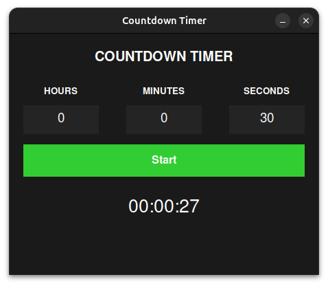

# Countdown Timer Project
 Overview

This is a simple countdown timer application built with Python using Tkinter for the graphical user interface (GUI) and the Pygame library for sound playback. The timer allows users to input hours, minutes, and seconds, then start a countdown. Once the countdown reaches zero, a beeping sound plays to indicate that the time is up.

The purpose of this project is to help me (the developer) learn and practice Python, especially with GUI development and integrating external libraries such as Pygame.
Features

  1) Set Hours, Minutes, and Seconds: Users can set the countdown time using input fields.
  2) Start Countdown: Press the "Start" button to initiate the countdown.
  3) Pause and Resume: (Future Feature - not yet implemented in this version).
  4) Play Sound: When the countdown reaches zero, a beeping sound is played multiple times.
  5) User-Friendly Interface: Clean and intuitive design created using Tkinter.

Libraries Used

  1) Tkinter: For creating the GUI.
  2) Pygame: For playing the sound upon countdown completion.

To install these libraries (if not already installed), you can use the following commands:

```
pip install pygame
```

Tkinter comes pre-installed with Python, so you don't need to install it separately.
How to Use

  1) Input Time: Enter the hours, minutes, and seconds into the respective fields. If you want a default value, just press "Start" after filling in the time.
  2) Start Countdown: Press the "Start" button to start the countdown.
  3) Time's Up: Once the countdown hits zero, a beeping sound will be played, and the label will display "TIME'S UP!".

## This is what it looks like:

